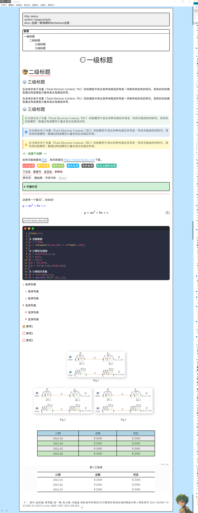

## 1.主题效果演示

> 此主题仅在Windows下设计和测试，在其操作系统上的效果未知！

## 2.主题特色

> 该主题参考了[typora-dyzj-theme](https://github.com/muggledy/typora-dyzj-theme)，在此表示感谢！

1. 提供了自定义样式的CSS文件：`happysimple.css`，打造自己的主题🤪！

   

2. 内置了很多字体：阿里妈妈普惠体：`Ali_PuHuiTi`、阿里妈妈刀隶体：`Ali_DaoLiTi`、阿里妈妈东方大楷：`Ali_DongFangDaKai`、阿里妈妈方圆体：`Ali_FangYuanTi`、阿里妈妈灵动体：`Ali_LingDongTi`、阿里妈妈数黑体：`Ali_ShuHeiTi`、钉钉进步体：`DingDing_JinBuTi`、思源黑体：`SiYuan_HeiTi`、思源宋体：`SiYuan_SongTi`、站酷仓耳渔阳体：`ZhanKu_YvYangTi`。此外，你还可以使用Windows自带的字体！

   

3. 右下角放置了一个卡通人物，，你可以将其更换为自己喜欢的图片或动图！你还可以调整它的位置！

   

4. 标题前可嵌入图标

   > 内置图标见下图，是不是很少，没错，我忒懒了🤔！你可以在[iconfont](https://www.iconfont.cn/)下载更多的图标，解压至`source/icon`文件夹即可！假如你要更换一级标题的图标，调整happysimple.css的`--h1-icon`变量即可！

   

   

5. 代码块采用了`mac风格`

   

6. 美化了自带的表格，还增加了`三线表`样式的表格

   

7. 增加了`小标签`、`折叠标签`、`强调型文本`和`字体特效` 

   

8. 此外，还美化了`YAML`、`目录`、`注释`、`超链接`、`公式`、`列表`等

## 3.获取方式

- <a href="https://alist.happysimple.club/lanzouyun/Typora-theme-Happysimple.rar" target="_blank">Alist-HappySimple</a>
- <a href="https://github.com/HappySimple/Typora-theme-Happysimple" target="_blank">Github</a>

## 4.主题安装

打开Typora➡️文件➡️偏好设置➡️外观➡️打开主题文件夹➡️将压缩包中的`source`和`happysimple.css`移动至此目录➡️重启Typora➡️选择主题

